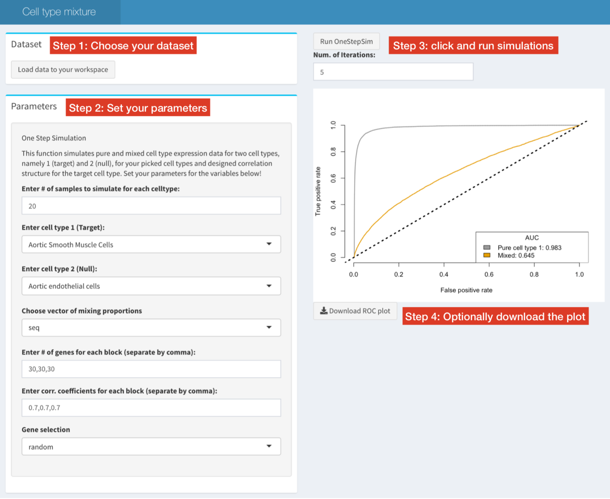

# Interactive exploration of the effect of tissue composition on gene co-expression

## Getting Started

Install package:
```R
install.packages("devtools")
devtools::install_github("yunzhang813/simDeNet-R-Package-Shiny")
```

Launch Shiny application for interactive exploration using pre-uploaded pure cell type data:
```R
library(simDeNet)
runShiny()
```



Browse vignette for other useful functions included in the pakcage:
```R
browseVignettes("simDeNet")
```

## Citation
Zhang, Y., Cuerdo, J., Halushka, M.K. and McCall, M.N., 2018. The effect of tissue composition on gene co-expression. *bioRxiv*, p.492223.